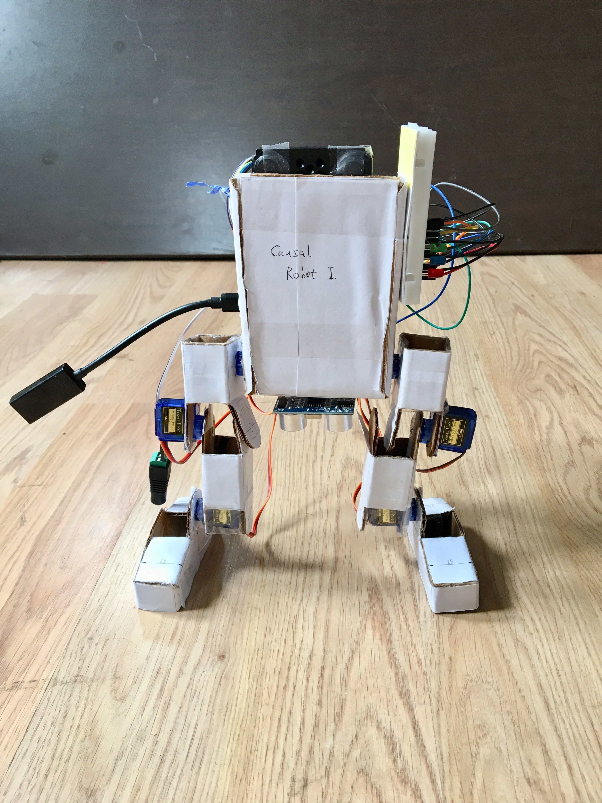

# Welcome to AO - Artificial Oscillation ￣|\_|￣|\_|￣|\_

The best, most powerful, autonomous artificial general intelligence agent in human history.

The document is structured into the following sections:

* Framework
* Math
* Environment
* Implementation
* Robot (previously called CausalRobot)

Here is an imaginary view of how the robot works.

