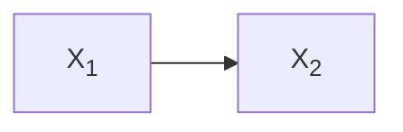
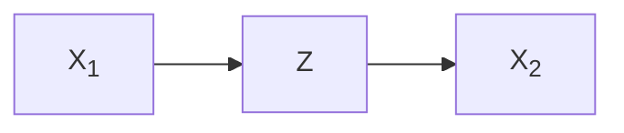

# Proof of concept

An initial knowledge graph looks like this, where X1 is action and X2 is sensor value.

We want to know if adding an hidden node Z could better explain the data.

The dataset is represented as

$$ \mathcal{D}=\{X_{1,1:T}, X_{2,1:T}\} \; . $$

We need to compare the likelihood of two models:

$$
\begin{aligned}
M_1&: P(X_{1,1:T},X_{2,1:T})\\
M_2&: P(X_{1,1:T},X_{2,1:T})=\sum_{Z_{1:T}} P(X_{1,1:T},X_{2,1:T},Z_{1:T}) \; .
\end{aligned}
$$

There are at least three ways to do model selection

1. AIC or AICc (preferred) or BIC: It involves the computation of likelihood $P(\mathcal{D}|\theta,M)$. Since $M_2$ contains hidden variable, the lower bound of likelihood can be estimated using [expectation maximization (EM)](proof-of-concept.md#expectation-maximization-em).
2. Bayesian factor: It involves the computation of the marginal likelihood (evidence) $P(\mathcal{D}|M)$, which can be estimated using evidence lower bound (ELBO) from [variational Bayesian inference (VB)](proof-of-concept.md#variational-bayesian-inference-vb).

### Expectation Maximization (EM)

For M2, the maximum likelihood is estimated using expectation maximization (EM): $\theta^{(t+1)}=\arg\max_\theta Q(\theta\,|\,\theta^{(t)}) =\arg\max_\theta \mathbb{E}_{Z|X,\theta^{(t)}}\left[\log L\left(\theta;X,Z\right)\right]$, where X is observed data and Z is hidden data.

The full likelihood is

$$
\begin{aligned}
L(\theta) &= P_\theta(X_{1,1:T}, X_{2,1:T}, Z_{1:T})\\
&= \prod_{t=1}^T P_\theta(X_{1,t}, X_{2,t}, Z_t\,|\,X_{1,1:t-1}, X_{2,1:t-1}, Z_{1:t-1})\\
&= \prod_{t=1}^T P_\theta(X_{1,t}, X_{2,t}, Z_t\,|\,X_{1,t-H-1:t-1}, X_{2,t-H-1:t-1}, Z_{t-H-1:t-1}) \;\;\;\text{(only consider horizon H)}\\
&=\prod_{t=1}^T\left[P_{\theta_2}(X_{2,t}\,|\,X_{1,t-H-1:t-1}, X_{2,t-H-1:t-1},Z_{t-H:t})\right] P(\theta_2\,|\,\eta_2)\\
&\;\;\;\;\;\;\times\prod_{t=1}^T\left[P_{\theta_z}(Z_t\,|\,X_{1,t-H:t}, X_{2,t-H-1:t-1},Z_{t-H-1:t-1})\right] P(\theta_z\,|\,\eta_z)\\
&\;\;\;\;\;\;\times\prod_{t=1}^T\left[P_{\theta_1}(X_{1,t}\,|\,X_{1,t-H-1:t-1}, X_{2,t-H-1:t-1},Z_{t-H-1:t-1})\right] P(\theta_1\,|\,\eta_1) \; .
\end{aligned}
$$

And if action $X_1$ is randomly assigned, then

$$
\begin{aligned}
L(\theta)&\propto\prod_{t=1}^T\left[P_{\theta_2}(X_{2,t}\,|\,X_{1,t-H-1:t-1}, X_{2,t-H-1:t-1},Z_{t-H:t})\right] P(\theta_2\,|\,\eta_2)\\
&\;\;\;\;\;\;\times\prod_{t=1}^T\left[P_{\theta_z}(Z_t\,|\,X_{1,t-H:t}, X_{2,t-H-1:t-1},Z_{t-H-1:t-1})\right] P(\theta_z\,|\,\eta_z) \; .
\end{aligned}
$$

More specifically,

Step 1: randomly generate $\theta^{(k=0)}$ from $P(P(\theta\,|\,\eta)$.

Step 2: sample $z_{1:T}^{(i)}$ from $P_{\theta^{(0)}}\left(Z_t\,|\,X_{1,t-H:t}, X_{2,t-H-1:t-1},Z_{t-H-1:t-1}\right)$ sequentially, where $i=1,\dots,M$.

Step 3: Compute $q^{(i)}=q_{\theta^{(0)}}\left(z_{1:T}^{(i)}\,|\,X_{1,1:T}, X_{2,1:T}\right)\propto P_{\theta^{(0)}}\left(X_{1,1:T}, X_{2,1:T}, z_{1:T}^{(i)}\right)$ for each sample, which is the unnormalized probability.

Step 4: Normalize $q$ so that mean(q)=1.

Step 5: Minimize

$$
\begin{aligned}
J(\theta)&=-Q(\theta\,|\,\theta^{(0)})=-\sum_i q^{(i)}\log L^{(i)}(\theta)\\
&=-\sum_{i=1}^M q^{(i)}\Biggl[\sum_{t=1}^T\left[\log P_{\theta_2}(X_{2,t}\,|\,X_{1,t-H-1:t-1}, X_{2,t-H-1:t-1},z_{t-H:t}^{(i)})\right]+\log P(\theta_2\,|\,\eta_2)\\
&\;\;\;\;\;\;+\sum_{t=1}^T\left[\log P_{\theta_z}(z_t^{(i)}\,|\,X_{1,t-H:t}, X_{2,t-H-1:t-1},z_{t-H-1:t-1}^{(i)})\right]+\log P(\theta_z\,|\,\eta_z)\Biggr] \\
&=\sum_{i=1}^M q^{(i)}\left[\sum_{t=1}^T loss(X_{2,t}, f_{\theta_2}^{(i,t)})+\sum_{t=1}^T loss(z_t^{(i)}, f_{\theta_z}^{(i,t)})\right]+reg(\theta_2)+reg(\theta_z) \; .
\end{aligned}
$$

The last step can be represented by two neural networks. Then set $k=k+1$ and repeat step 2, until $|\theta^{(k+1)}-\theta^{(k)}| < \varepsilon$.

### Variational Bayesian Inference (VB)

?
